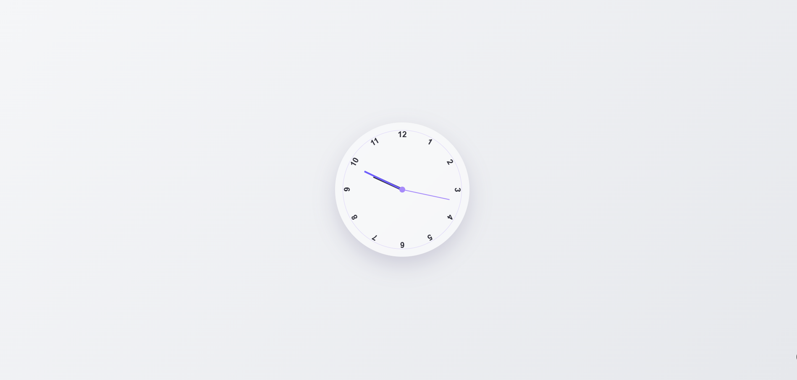

# Orologio Analogico

Un orologio analogico minimal realizzato con HTML, CSS e JavaScript.

## Caratteristiche
- Aggiornamento in tempo reale tramite JavaScript
- Movimento fluido di ore, minuti e secondi
- Utilizzo delle CSS variables per la rotazione dinamica
- Design pulito e moderno

##  Tecnologie utilizzate
- HTML5
- CSS3 (transform, variabili CSS, calc)
- JavaScript (DOM, Date, setInterval)

## Come funziona
L’orologio utilizza l’oggetto `Date` di JavaScript per ottenere l’orario corrente.

Le lancette vengono ruotate calcolando la loro posizione in base a:
- secondi → aggiornamento ogni secondo
- minuti → influenzati anche dai secondi
- ore → influenzate da minuti e secondi

La rotazione viene applicata tramite variabili CSS (`--rotation`).

## 📸 Anteprima

## 🔗 Demo
(Aggiungi qui il link GitHub Pages)

